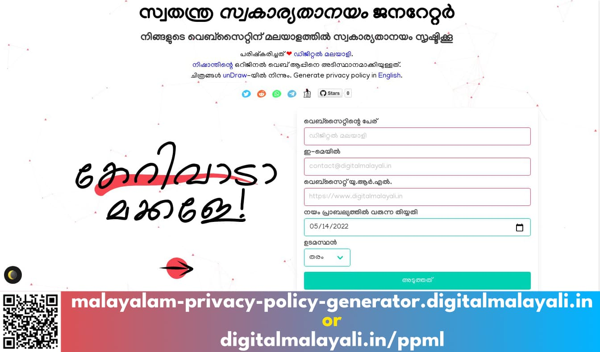
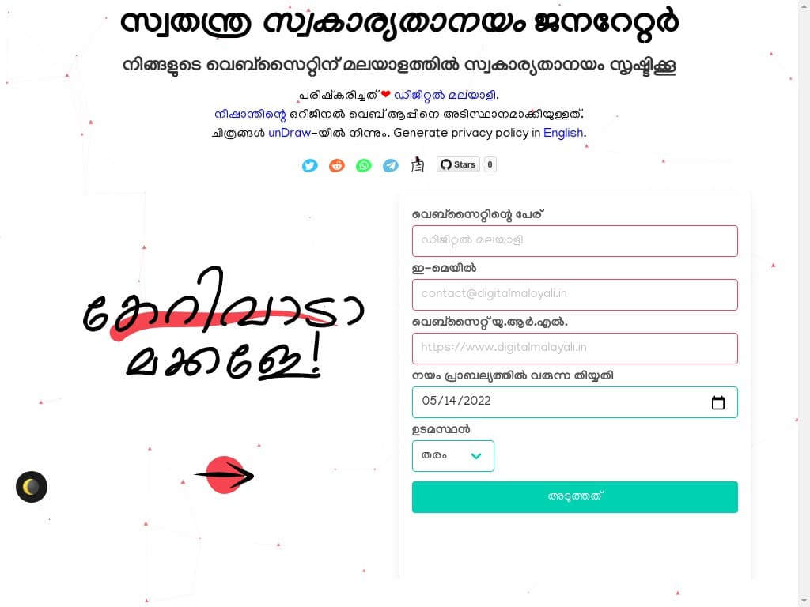
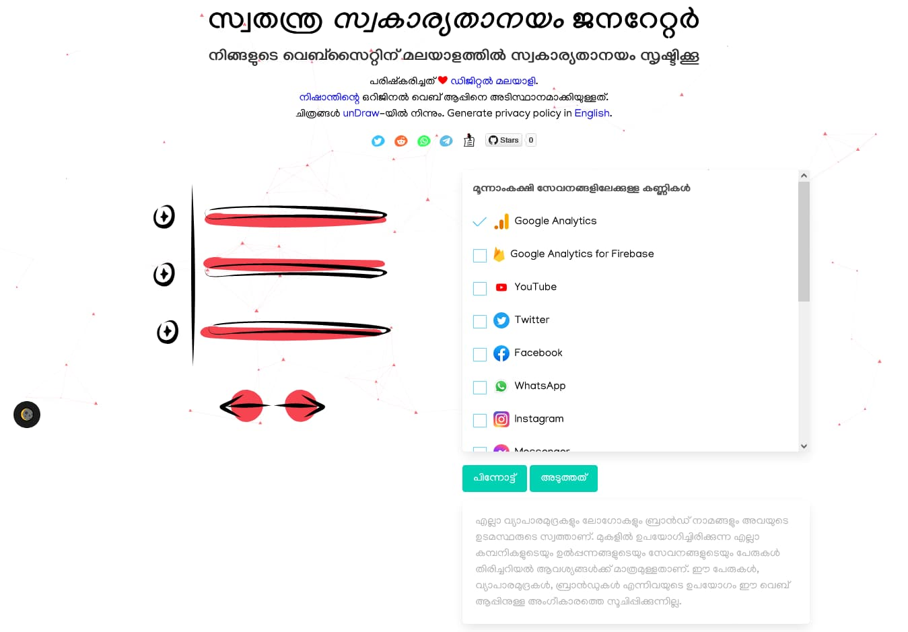
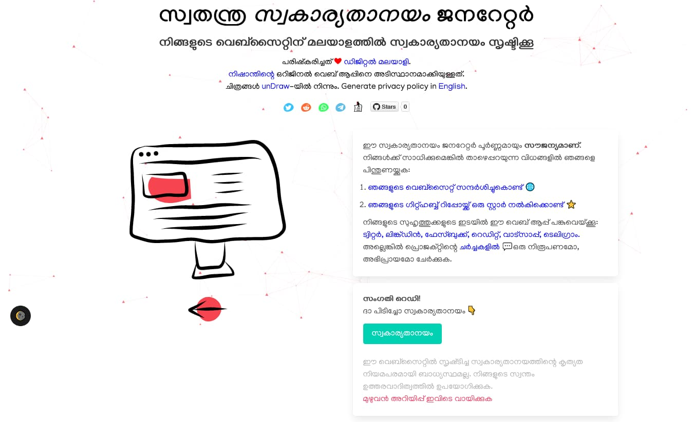

    
  

<strong>
  <em>നിങ്ങളുടെ വെബ്സൈറ്റിന് മലയാളത്തിൽ സ്വകാര്യതാനയം ജനറേറ്റ് ചെയ്യാൻ വേണ്ടിയുള്ള സൗജന്യ വെബ് ആപ്പ്</em>
</strong> 
<a href="https://malayalam-privacy-policy-generator.digitalmalayali.in/">വെബ് ആപ്പിലേക്ക് പോവാൻ ഇവിടെ ക്ലിക്ക് ചെയ്യുക</a>.
  
  
ഇംഗ്ലീഷിൽ സ്വകാര്യതാനയം സൃഷ്ടിക്കാൻ, <a href="https://free-privacy-policy-generator.digitalmalayali.in/">ഇതിലേ</a> പോവുക.

 

## പിന്നണിയിൽ 🙏

[നിഷാന്തിന്റെ](https://github.com/nisrulz/nisrulz.github.io#nishant-srivastava) വെബ് ആപ്പിനെ അടിസ്ഥാനമാക്കി മാറ്റങ്ങൾ വരുത്തിയാണ് ഈ ആപ്പ് നിർമ്മിച്ചിരിക്കുന്നത്. ദയവായി അദ്ദേഹത്തെ പിന്തുണയ്ക്കുക.

[unDraw](https://undraw.co/)-യിൽ നിന്നുമാണ് ചിത്രങ്ങൾ. [particles.js](https://github.com/VincentGarreau/particles.js/) ഉപയോഗിച്ചാണ് ബാക്ക്ഗ്രൗണ്ട് സൃഷ്ടിച്ചിരിക്കുന്നത്. [GoogleChromeLabs](https://github.com/GoogleChromeLabs/dark-mode-toggle)-ൽ നിന്നുമാണ് ഡാർക്ക് മോഡ്. 

## ഈ പ്രൊജക്റ്റിനെ പിന്തുണയ്ക്കാനുള്ള വഴികൾ 💕

- ഈ റിപ്പോസിറ്ററി **സ്റ്റാർ** ചെയ്ത് സുഹൃത്തുക്കളോട് ഇതിനെപ്പറ്റി പറയുക.
- മാറ്റങ്ങളെയും പുതുമകളെയും പറ്റി അറിയാൻ റിലീസുകൾ **നിരീക്ഷിക്കുക**.
- എന്തെങ്കിലും പിഴവുകളോ, പോരായ്മകളോ, പ്രശ്നങ്ങളോ കണ്ടാൽ [**ഇഷ്യൂ ഓപ്പൺ ചെയ്യുക**](https://github.com/digitalmalayali/free-malayalam-privacy-policy-generator/issues/new/choose).
- മൂന്നാംകക്ഷികളെ ചേർക്കാനോ, [പിഴവുകൾക്കുള്ള](https://github.com/digitalmalayali/free-malayalam-privacy-policy-generator/issues) പരിഹാരമോ ഉണ്ടെങ്കിൽ **പുൾ റിക്വസ്റ്റ് ഓപ്പൺ ചെയ്യുക**.

- ഈ പ്രൊജക്റ്റ് നിങ്ങൾക്ക് ഇഷ്ടപ്പെട്ടാൽ അല്ലെങ്കിൽ ഇത് നിങ്ങൾക്ക് ഉപകാരപ്പെട്ടതിനെപ്പറ്റിയോ ഞങ്ങളോട് പറയുക!

  - [പ്രൊജക്റ്റിന്റെ ചർച്ചകളിൽ അഭിപ്രായമറിയിക്കൂ](https://github.com/digitalmalayali/free-malayalam-privacy-policy-generator/discussions) :blush:,
  - [ട്വിറ്ററിൽ](https://twitter.com/digimalayali) ഞങ്ങളെ ബന്ധപ്പെടൂ,
  - അല്ലെങ്കിൽ [നല്ലൊരു മെയിലയക്കൂ](mailto:contact@digitalmalayali.in)!

നിങ്ങളുടെ താത്പര്യത്തിന് നന്ദി! :heart:

## സ്ക്രീൻഷോട്ടുകൾ 💻

 
 

## ലൈസൻസ് 📝

[GNU Affero General Public License v3.0](LICENSE)

© പകർപ്പവകാശം 2022-2023 ഡിജിറ്റൽ മലയാളി, നിഷാന്ത് ശ്രീവാസ്തവ
